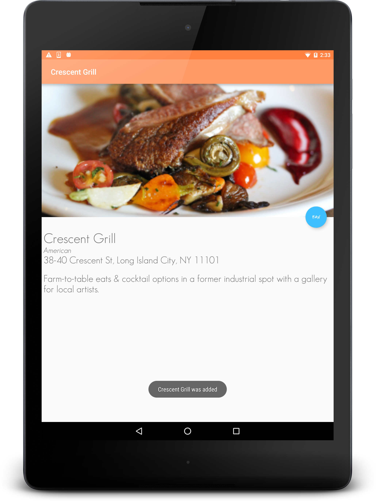

title | type | creator
----- | ---- | -------
Neighborhood Guide App | project | Adityo Sagir (ADI - New York)

## Overview

This Neighborhood Guide app allows users to search for restaurants in the Astoria and/or 
Long Island City.

Users can search by restaurant name, cuisine or address. This allows flexibility for the 
user to search for items if they are unsure of some of the attributes. 

Users can also select/de-select favorite restaurants and add them to a favorites list.

## Screenshots

A portrait screenshot of how the app looks in the main screen 

A portrait screenshot of a detailed view of restaurant with a favorite button 

A portrait screenshot showing a favorite has been added 

A landscape screenshot of a favorite being removed 

# Enjoy :)
